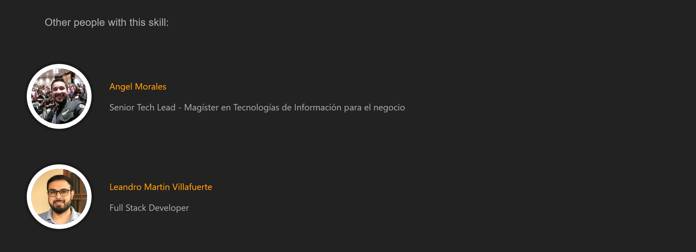

# User-Skills-React

> This project is a web application that allows you to list all the skills that a user has by entering their username. The users and their skills come from Torre API, which is a revolutionary recruitment platform that emphasizes AI in the recruitment process. Additionally, you can also find related experiences for the user on each skill, as well as other users who possess the same skill

## Screen shots

- 
- 

## Built With
- 
- 
- 
- 
- 
- 

- 
- 

## Live Demo (if available)

[Live Demo Link](https://user-skill-react.netlify.app/)

## Author

👤 **Terbeche Mostefa**

- GitHub: [@githubhandle](https://github.com/Terbeche)
- LinkedIn: [LinkedIn](https://www.linkedin.com/in/mustapha-terbeche/)

## Setup

If you wish to run the project locally, please do the following:

1.- Clone the repository to your local machine. - **`git clone https://github.com/Terbeche/User-Skills-React.git`** - **`cd User-Skills-React`**

2.- Install Node.js and npm if you haven't already.
To install Node.js, follow the instructions on [Node.js](https://nodejs.org/en/).

To install npm with the necessary dependencies, run the following command in your terminal:

```bash
npm install
```

3.- Once you have the setup and the project locally, you can run the project using the following command in your terminal:

```bash
npm run build
```

4.- and if you want to watch the changes live, run the following command (it will run the website on localhost:3000):

```bash
npm start
```

## Show your support

Give a ⭐️ if you like this project!

## Acknowledgments

## 📝 License

This project is [MIT](./MIT.md) licensed.
